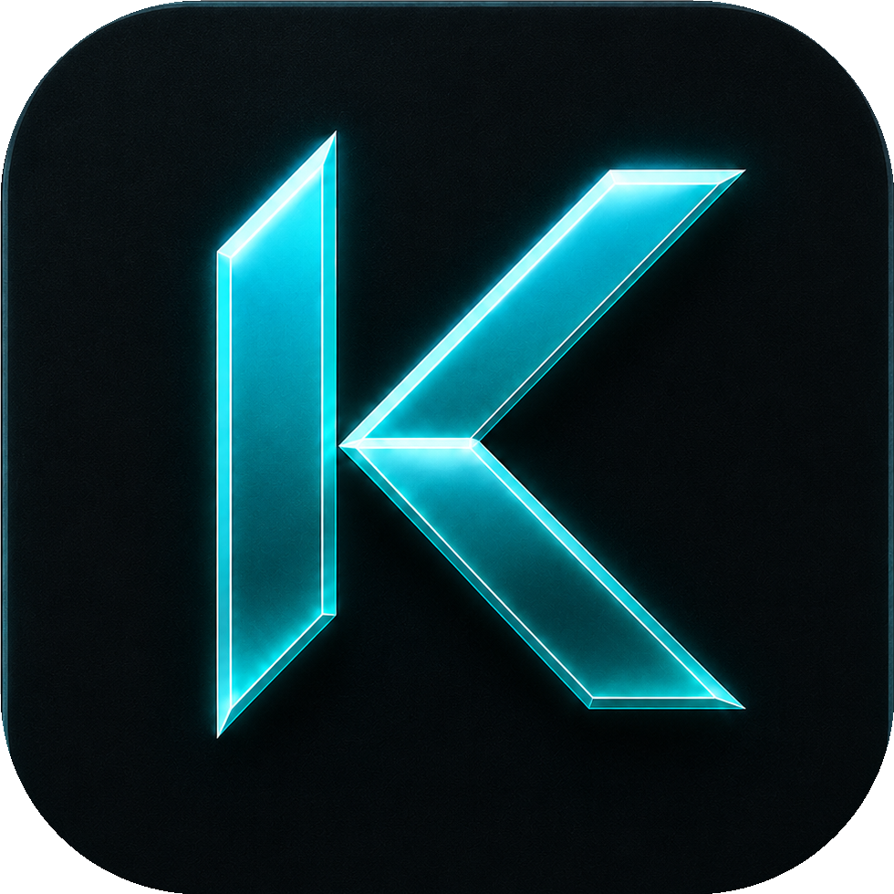

<div align="center">
  
  <h1>Koden</h1>

  <p><strong>A terminal-first, AI-native dev workspace.</strong></p>

  <p>
    
    
    
  </p>

  <p>
    <a href="#install">Install</a> ·
    <a href="#the-agent-layer">Agents</a> ·
    <a href="#features">Features</a> ·
    <a href="#build-from-source">Build</a> ·
    <a href="#license">License</a>
  </p>
</div>

---

Koden is a fast local terminal for people who work alongside AI agents. It adds a layer for running several coding agents at once, so you can see what each one is doing instead of losing track of them across tabs.

It runs on Tauri 2 and Rust with a React 19 front end. The terminal uses a native PTY and a WebGL renderer, and a code editor, file tree, git with a commit graph, and a web preview are built in. The whole app is about 7 to 8 MB. There is no telemetry and no account.

## The agent layer

What sets Koden apart is how it handles several agents at once:

- **Agent Dock.** Every agent you launch is tied to the pane it runs in and shows a live status: working, waiting on you, done, or errored.
- **Tasks.** A board of what each agent is doing. It survives restarts.
- **Topology graph.** A map of your agents and their sub-agents, so a big parallel run is something you can actually follow.
- **Roll-up alerts.** The most urgent status in a tab bubbles up to the tab and flashes the taskbar, so a background agent that needs you does not sit there unnoticed.

## Features

**Terminal.** Native PTY for zsh, bash, pwsh, fish, and cmd. WebGL rendering, split panes including 4-way, history search, find-in-terminal, and clickable output where file paths reveal in the explorer and secrets copy on click. On Windows, each tab can run Local or any installed WSL distro.

**Editor.** CodeMirror 6 with the common languages, inline AI autocomplete, AI edit diffs you accept or reject per hunk, Vim mode, and ten editor themes.

**Git.** Stage and unstage by hunk, commit and push with upstream awareness, and a history pane with a real commit graph.

**AI.** Bring your own key for OpenAI, Anthropic, Google, Groq, xAI, Cerebras, OpenRouter, DeepSeek, or Mistral, or any OpenAI-compatible endpoint. Run local models through LM Studio, MLX, or Ollama. Agents can plan, spawn sub-agents, read and edit files, run grep and glob, and run shell commands behind an approval gate. Plan mode confirms multi-step work before it runs.

Also included: a file explorer with fuzzy search and attach-to-AI, custom in-app themes with background images, and a web preview that picks up your local dev servers.

## Install

Grab the latest installer from the [Releases](https://github.com/MrOlof/koden/releases/latest) page. Auto-update is built in but off by default; turn it on in Settings once you trust the release feed.

**Windows.** On first launch you will see "Windows protected your PC" because Koden is not code-signed yet. Click More info, then Run anyway. Shell detection prefers `pwsh.exe`, then `powershell.exe`, then `cmd.exe`. WSL is a first-class environment, not a wrapped subprocess.

**Linux.** AUR: `yay -S koden-bin` (or paru). Nix: `nix profile install github:MrOlof/koden`, or add `inputs.koden.packages.${pkgs.system}.koden` to your system packages via the flake. AppImage needs FUSE; without it run `./Koden_*.AppImage --appimage-extract-and-run`. On Wayland with rendering glitches try `WEBKIT_DISABLE_DMABUF_RENDERER=1`, or use the `.deb` / `.rpm` packages, which tend to be smoother.

## Configure AI

Open Settings, then AI. Pick a provider and paste your API key, or point Koden at a local LM Studio, MLX, or Ollama endpoint. Keys are stored in the OS keychain through `keyring`, never on disk or in localStorage.

## Build from source

You will need Rust (stable), Node 20+ with [pnpm](https://pnpm.io), and the [Tauri prerequisites](https://tauri.app/start/prerequisites/) for your platform.

```bash
pnpm install
pnpm tauri dev      # development
pnpm tauri build    # production bundle
```

Checks that match CI:

```bash
pnpm exec tsc --noEmit
cd src-tauri && cargo clippy --all-targets --locked -D warnings
cd src-tauri && cargo test --locked
```

## Tech stack

Tauri 2, Rust, `portable-pty`, React 19, TypeScript, Vite, xterm.js, CodeMirror 6, Vercel AI SDK v6, Tailwind v4, shadcn/ui, and Zustand.

## Contributing

Issues and pull requests are welcome. See [CONTRIBUTING.md](CONTRIBUTING.md).

## License

Apache-2.0. See [LICENSE](LICENSE).
